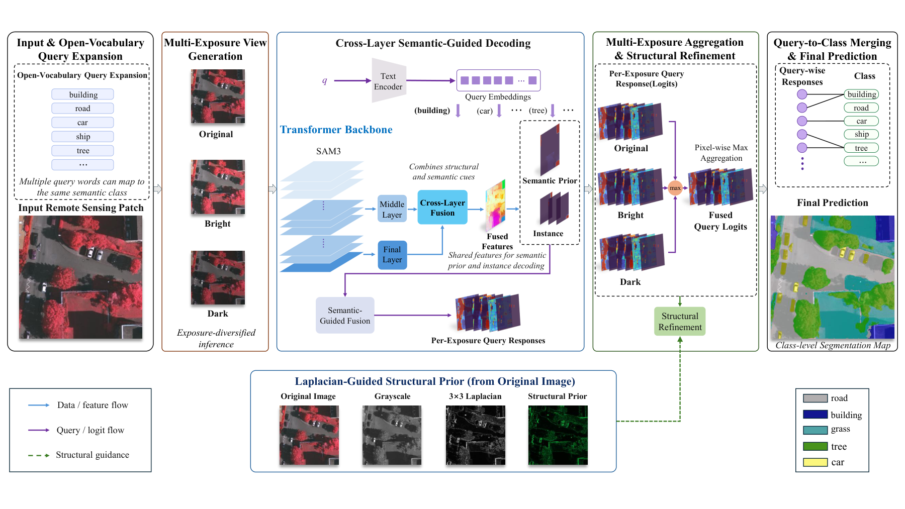
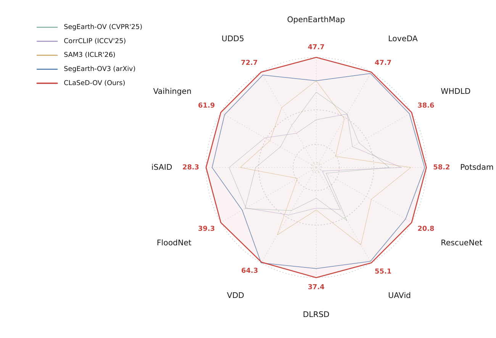
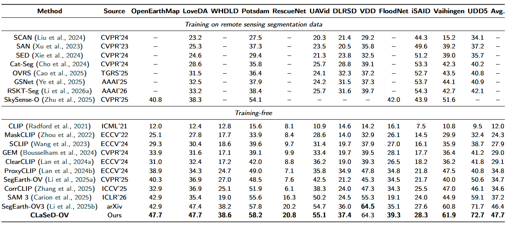
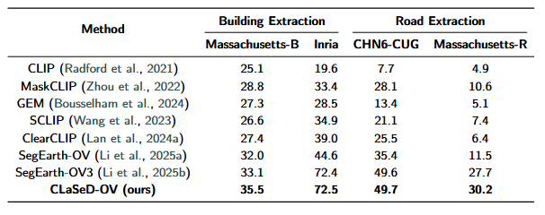
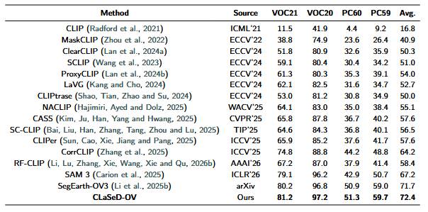

# CLaSeD-OV

Official code release for **CLaSeD-OV: Cross-Layer Semantic-Guided Decoding for Training-Free Open-Vocabulary Remote Sensing Semantic Segmentation**.

## Abstract

Open-vocabulary remote sensing semantic segmentation assigns pixel-level labels to arbitrary textual categories beyond predefined taxonomies. Although training-free methods based on frozen vision-language and segmentation foundation models have enabled dense open-vocabulary prediction, they still suffer from weak localization, coarse boundaries, and incomplete region coverage in complex geospatial scenes. This limitation mainly arises because query-aware semantic modeling is insufficiently strengthened before semantic-instance coordination, and is further amplified by dense small objects, weak boundaries, heterogeneous structures, and illumination variations. To address these challenges, we propose CLaSeD-OV, a Cross-Layer Semantic-Guided Decoding framework for training-free open-vocabulary remote sensing segmentation.

CLaSeD-OV reorganizes prompt-conditioned semantic and instance evidence into a unified query-wise inference process. Instead of static response-level fusion of decoupled predictions, it integrates spatially informative intermediate-layer representations with semantically rich final-layer representations to produce stronger semantic evidence for each query, which supports instance-centered prediction and improves the coordination between region-level completeness and object-level localization. To enhance structural fidelity, Laplacian-Guided High-Frequency Structural Refinement injects image-derived boundary cues into query-wise logits without trainable parameters. Multi-Exposure View Aggregation further improves photometric robustness by fusing query-level responses from exposure-diversified views.

The framework requires no pixel-level annotation, parameter update, domain-specific retraining, or auxiliary external backbone. Extensive evaluations on 20 benchmarks demonstrate its effectiveness and generality. On twelve remote sensing semantic segmentation datasets, CLaSeD-OV achieves 47.7 average mIoU, outperforming frozen SAM 3 by 10.5 points and SegEarth-OV3 by 1.3 points, while generalizing to remote sensing extraction and natural-image segmentation.

## Highlights

- Training-free open-vocabulary remote sensing semantic segmentation.
- Cross-layer semantic-guided decoding for stronger query-wise evidence.
- Boundary-aware structural refinement without parameter updates.
- Multi-exposure aggregation for robust dense prediction.
- Evaluated on 20 semantic, extraction, and natural-image benchmarks.

## Method Overview

<p align="center">
  
</p>

<p align="center">
  <a href="figs/CLaSeD-OV.pdf">High-resolution PDF</a>
</p>

## Installation

```bash
conda create -n clased-ov python=3.10 -y
conda activate clased-ov

pip install torch==2.4.0+cu121 torchvision==0.19.0+cu121 --index-url https://download.pytorch.org/whl/cu121
pip install -U openmim
mim install mmengine==0.10.7
mim install mmcv==2.2.0
pip install mmsegmentation==1.2.2
pip install -r requirements.txt
```

The frozen SAM 3 image checkpoint is not included. Please obtain it from an official or otherwise authorized source, follow the applicable SAM 3 license and checkpoint terms, and place it at:

```text
weights/sam3/sam3.pt
```

Datasets, checkpoints, and generated files are ignored by Git.

## Data Layout

Datasets are expected under `data/` by default.

| Dataset | Config | Default Root | Images | Masks |
| --- | --- | --- | --- | --- |
| CHN6-CUG | `configs/cfg_chn6-cug.py` | `data/CHN6-CUG` | `CHN6-CUG/image_cvt` | `CHN6-CUG/label_cvt` |
| Pascal Context 59 | `configs/cfg_context59.py` | `data/VOCdevkit/VOC2010` | `JPEGImages` | `SegmentationClassContext` |
| Pascal Context 60 | `configs/cfg_context60.py` | `data/VOCdevkit/VOC2010` | `JPEGImages` | `SegmentationClassContext` |
| DLRSD | `configs/cfg_dlrsd.py` | `data/DLRSD` | `img_dir/val` | `ann_dir/val` |
| FloodNet | `configs/cfg_floodnet.py` | `data/FlodNet` | `val/val-org-img` | `val/val-label-img` |
| iSAID | `configs/cfg_iSAID.py` | `data/iSAID` | `img_dir/val` | `ann_dir/val` |
| Inria | `configs/cfg_inria.py` | `data/inria` | `img_dir/split_test` | `ann_dir/split_test` |
| LoveDA | `configs/cfg_loveda.py` | `data/LoveDA` | `img_dir/val` | `ann_dir/val` |
| Massachusetts Building | `configs/cfg_massachusetts_building.py` | `data/mass_building` | `images` | `label` |
| Massachusetts Road | `configs/cfg_massachusetts_road.py` | `data/mass_roads` | `images` | `label_cvt` |
| OpenEarthMap | `configs/cfg_openearthmap.py` | `data/OpenEarthMap/OpenEarthMap` | `img_dir/val` | `ann_dir/val` |
| Potsdam | `configs/cfg_potsdam.py` | `data/potsdam` | `img_dir/val` | `ann_dir/val` |
| RescueNet | `configs/cfg_rescuenet.py` | `data/RescueNet` | `test-org-img` | `test-label-img` |
| UAVid | `configs/cfg_uavid.py` | `data/UAVid` | `img_dir/test` | `ann_dir/test` |
| UDD5 | `configs/cfg_udd5.py` | `data/UDD5` | `val/src` | `val/gt` |
| Vaihingen | `configs/cfg_vaihingen.py` | `data/vaihingen` | `img_dir/val` | `ann_dir/val` |
| VDD | `configs/cfg_vdd.py` | `data/VDD` | `test/src` | `test/gt` |
| Pascal VOC 20 | `configs/cfg_voc20.py` | `data/VOCdevkit/VOC2012` | `JPEGImages` | `SegmentationClass` |
| Pascal VOC 21 | `configs/cfg_voc21.py` | `data/VOCdevkit/VOC2012` | `JPEGImages` | `SegmentationClass` |
| WHDLD | `configs/cfg_whdld.py` | `data/WHDLD` | `Images` | `Labels` |

## Evaluation

```bash
python eval.py configs/cfg_loveda.py
```

Save offline predictions:

```bash
python eval.py configs/cfg_loveda.py --out work_dirs/loveda_predictions
```

Evaluation writes results to `work_dirs/<config_name>/results.txt` and `results.xlsx`.

## Results

Semantic segmentation results are reported as mIoU (%). Remote sensing extraction results are reported as IoU (%).

<p align="center">
  
</p>

<p align="center">
  <a href="figs/selected_methods_radar.pdf">High-resolution PDF</a>
</p>

### Remote Sensing Semantic Segmentation



### Remote Sensing Extraction



### Natural-Image Segmentation



## License

The original CLaSeD-OV code and documentation are released under the Apache License 2.0. See `LICENSE`.

The `sam3/` directory is derived from Meta SAM 3 materials and remains subject to Meta's SAM License. A local copy is provided in `SAM_LICENSE`. SAM 3 checkpoint weights are not included and must be obtained from an official or otherwise authorized source. See `THIRD_PARTY_NOTICES.md` for third-party license notes.

## Notes

- Datasets and SAM 3 checkpoints are not included.
- `weights/sam3/sam3.pt`, `results.xlsx`, `work_dirs/`, `show_dir/`, and Python cache files are ignored by Git.
- This project builds on SAM 3 and the OpenMMLab segmentation stack. Please follow upstream licenses and checkpoint usage terms.
